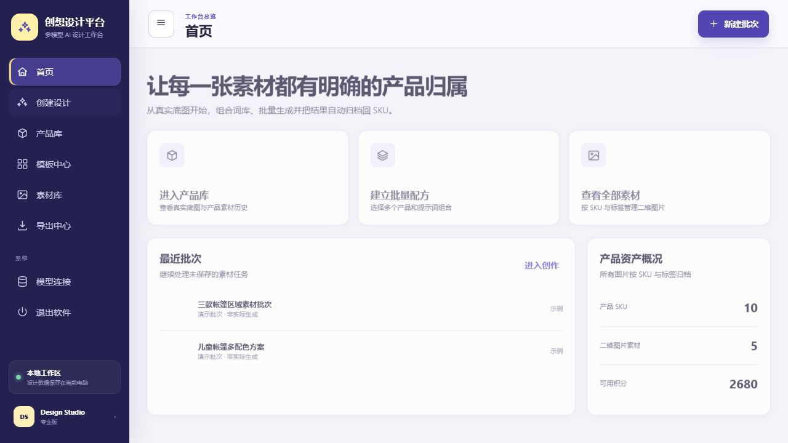
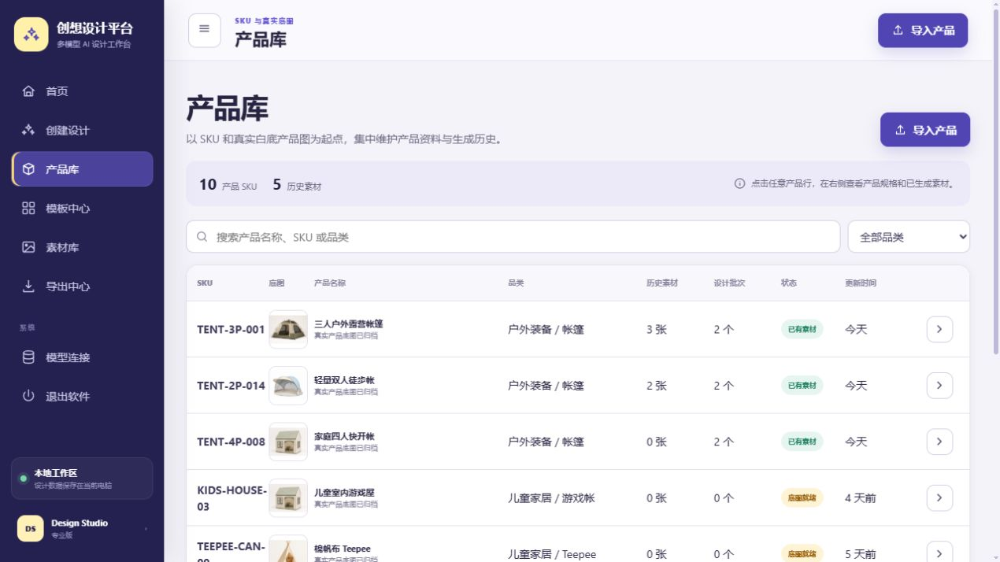
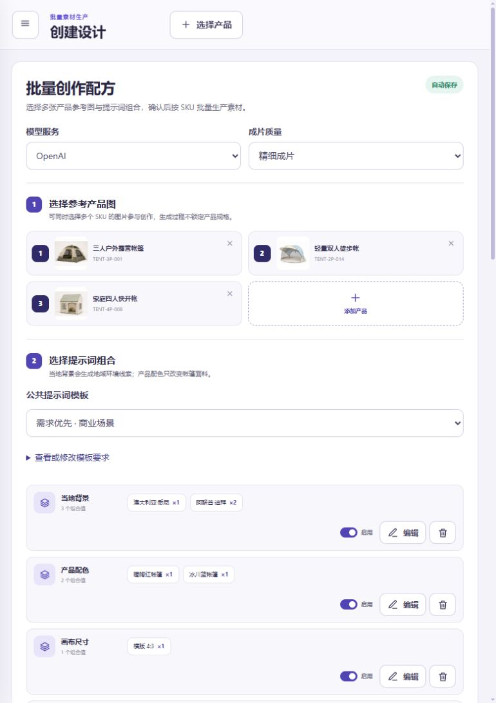
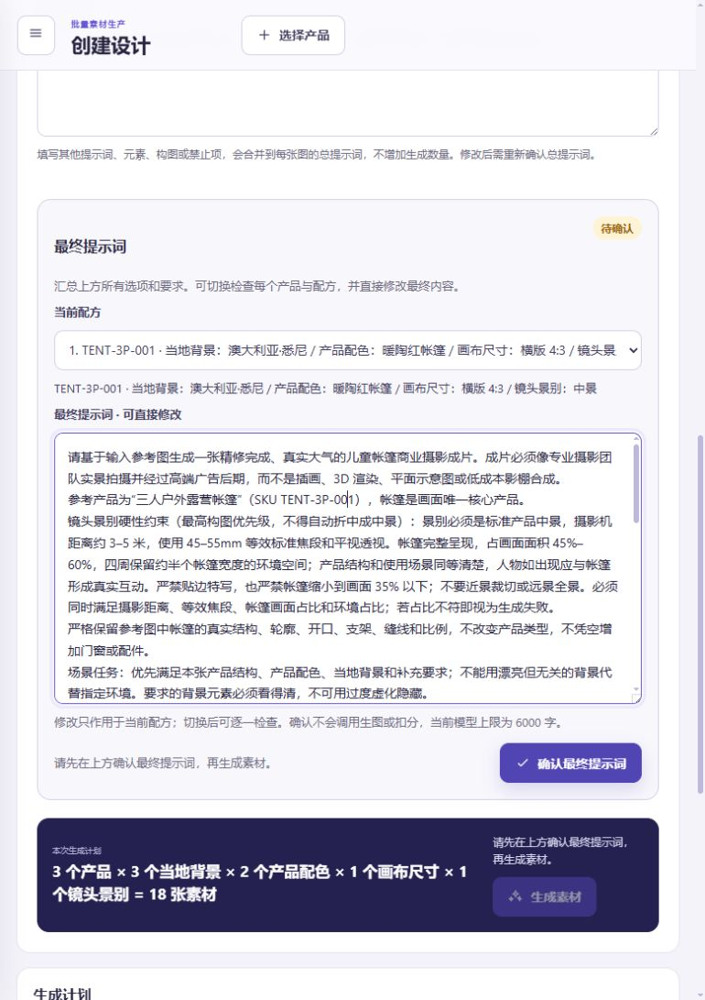
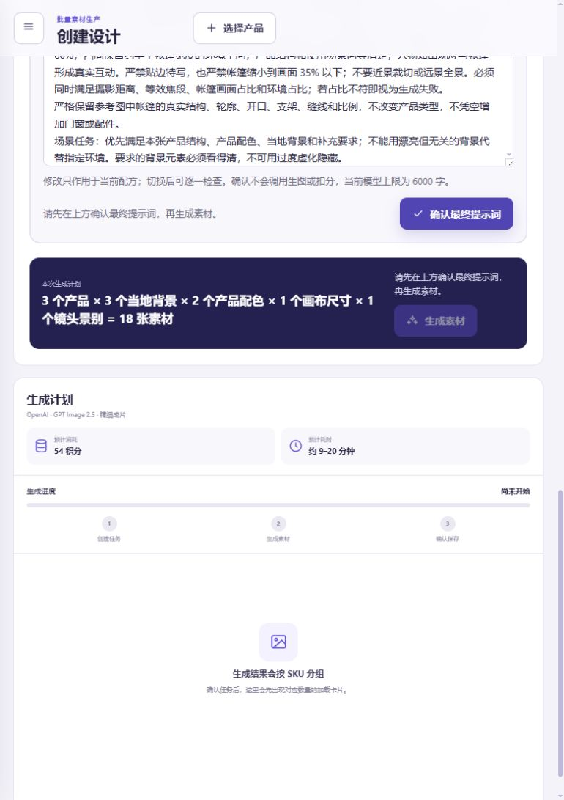
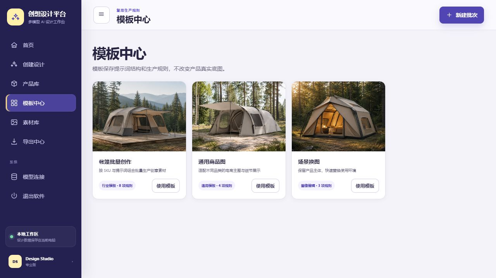
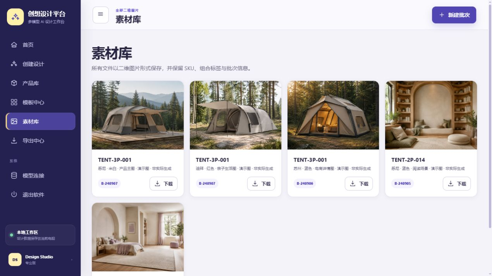
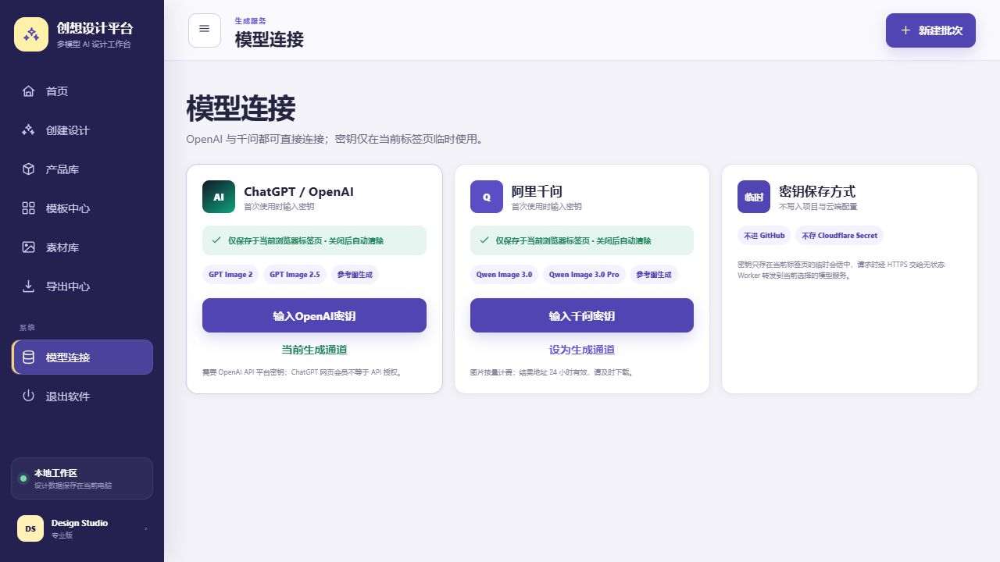
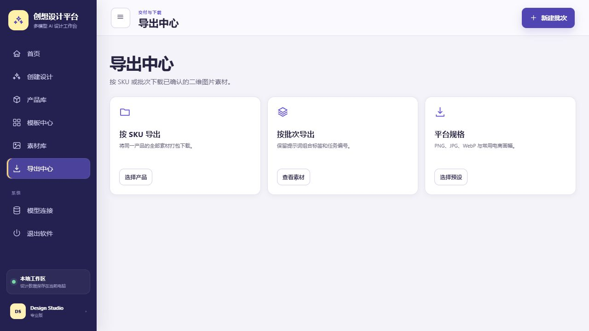

# 创想设计平台：第一性原理与对抗性审查

审查日期：2026-09-15
审查范围：线上界面、前端状态与提示词机制、Cloudflare Worker、OpenAI/千问适配、本地服务、测试与设计规范。
审查方式：真实线上界面截图、静态代码审查、现有测试回归、7 项无付费结构消融实验、官方接口契约核验。未调用任何付费生图接口。

> 本文保留修复前的审查快照。2026-09-15 的逐项整改状态与复测结果见 [REMEDIATION.md](./REMEDIATION.md)：结构消融现为 **7/7 通过**；仍待用户授权付费的 32 张真实图片盲评不在本轮自动执行范围内。

## 结论

当前软件可以作为“可演示的批量生图工作台 MVP”，但不能通过“核心机制已经被验证”的生产门槛。

- 结构消融实验仅 **5/7 通过**。当地背景、镜头景别、白底规则、其他要求、公共提示词模板能够进入最终提示词；“模板中心”和“数量 ×N”两项失败。
- 现有自动化测试全部通过，但测试主要证明页面与接口被正确连接，不证明生成图片真的保留产品结构、出现正确地标、形成明显景别差异或具备交付质量。
- 默认批次显示 18 张，实际只有 12 份唯一提示词；其余 6 次是语义完全相同的重复付费请求。
- 模板中心的“使用模板”只修改 `templateId`；该字段不进入提示词、组合、确认指纹或模型请求，是安慰剂功能。
- “4K”是浏览器画布插值放大，不会增加真实纹理与结构细节；“导出中心”目前只有跳转按钮，没有打包、格式转换或平台规格导出。
- 前端核心逻辑集中在一个 1,626 行、156 KB 的文件中；本地状态、界面、领域规则、提示词编译、生成队列、模型适配和导出相互耦合，已不符合高内聚、低耦合。

因此，本次审查的严格判定是：**核心价值链未通过完整消融验证，暂不应把“批量、模板、4K、导出”作为已完成能力对外承诺。**

## 第一性原理

用户真正购买的不是“提示词”和“生图次数”，而是可交付、符合需求、可重复生产的产品素材。最小价值函数可写成：

`有效价值 = 需求符合度 × 产品保真度 × 可辨别方案数 × 可交付性 ÷ 成本 ÷ 等待时间 ÷ 失败风险`

据此，软件的最小核心链路只有七步：

1. 输入可追溯的 SKU 参考图。
2. 把地点、配色、画幅、景别等选择归一化为一份配方。
3. 纯函数编译最终提示词，并展示真实任务数量与成本。
4. 用户确认不可变的任务快照。
5. 模型适配器提交、查询、超时、重试和取消任务。
6. 用明确标准验收产品结构、地点、景别和缺陷。
7. 按 SKU 保存原图、参数、提示词、模型、时间和验收结果，并可真实导出。

任何不改变这条链路结果的控件都应删除；任何无法被观测和验收的“智能”都不算核心能力。

## 界面流程审查

### 1. 首页 — 🟡 基本健康



优点：产品、批量配方和素材三条主路径清晰，演示批次被显式标记。
风险：首页承诺“自动归档回 SKU”，但线上实际持久化主要依赖当前浏览器；尚无云端对象存储、账号归属或审计记录。

### 2. 产品库 — 🟡 可用但不是生产资产库



优点：SKU、真实底图、状态与历史素材归属清楚。
风险：列表由 `div` 模拟九列表格，视觉上可扫读，但缺少真实表格表头关系；图片与完整状态整体序列化到浏览器存储，容量和恢复性不足。

### 3. 批量配方顶部 — 🟡 结构清楚，默认计划有浪费



优点：模型与质量位于顶部；产品、组合和成本的因果关系可见。
风险：迪拜数量为 ×2，却没有“变体编号、随机种子或差异化要求”，导致同一 SKU 的两个迪拜任务提示词完全相同。

### 4. 最终提示词 — 🟡 有确认闸门，但可审查性不足



优点：用户可以查看、修改、确认最终提示词；配方变化会使确认失效。
风险：默认提示词约 1,411–1,432 个中文字符，并重复表达景别、摄影、质感和验收规则。18 个配方只能逐项下拉检查，认知负担高；规则越长不等于服从度越高，冲突优先级也更难解释。

### 5. 生成计划与结果 — 🔴 核心产出尚未被证明



优点：计划张数、积分、预计时间、进度和 SKU 分组明确。
风险：18 张默认预计 9–20 分钟，且没有自动质量评分、地标识别、帐篷占比测量或结构一致性比较。用户只能生成后人工逐张判断；这意味着“高质量”和“符合需求”仍是文案，而不是被测量的系统能力。

### 6. 模板中心 — 🔴 安慰剂功能



按钮只修改 `state.studio.templateId`。该字段没有进入 `generationPrompt`、`buildCombinations`、`reviewFingerprint` 或任何 Worker 请求。界面提示“提示词结构和输出规格已准备好”与实际行为不一致。

### 7. 素材库 — 🟡 归属清楚，存储与交付薄弱



优点：演示素材被标记，SKU 与批次信息保留。
风险：素材以 URL 或 base64 混在同一个状态对象里；千问临时 URL、浏览器容量限制和 OpenAI base64 都可能造成丢失或状态膨胀。

### 8. 模型连接 — 🟡 隐私边界清楚，权限验证不充分



优点：密钥仅保存在标签页 `sessionStorage`，Worker 不持久化，符合当前“首次输入密钥”的要求。当前 OpenAI 模型名和 `/images/edits` 接口与官方文档一致，不是故障来源。[OpenAI GPT Image 2.5 Sunburst](https://developers.openai.com/api/docs/models/gpt-image-2.5-sunburst)
风险：`/models` 成功只能证明密钥基本有效，不能证明当前项目拥有所选图像模型权限或足够额度；真正生成前重复验证还会增加延迟。

### 9. 导出中心 — 🔴 功能未实现



三个按钮分别跳转产品库、素材库和模板中心。没有 ZIP 打包、按批次导出、PNG/JPG/WebP 转换、命名规则或电商平台规格处理，当前文案超出了实现。

## 无付费消融实验

实验脚本：[ablation.mjs](./ablation.mjs)

所有实验固定产品、模型、质量和其他配方，只改变一个变量；观测最终提示词、确认指纹和任务唯一性。

| 编号 | 核心假设 | 结果 | 证据 |
|---|---|---:|---|
| A1 | 切换模板中心模板应改变提示词并使确认失效 | **失败** | `prompt_changed=false`；`fingerprint_changed=false` |
| A2 | 数量 ×N 应产生 N 个可辨别意图 | **失败** | 每 SKU 6 个任务仅 4 份唯一提示词；全批 18 个任务仅 12 份唯一提示词 |
| A3 | 当地背景应把可识别地标加入提示词 | 通过（结构层） | 开启时包含悉尼歌剧院/海港大桥，关闭后消失 |
| A4 | 近/中/远景应形成互斥构图约束 | 通过（结构层） | 三份唯一提示词，目标占比分别为 80–95%、45–60%、12–25% |
| A5 | 白底模式应消除地域背景 | 通过（结构层） | 地标消失，纯白背景规则保留 |
| A6 | 其他要求应进入提示词并使确认失效 | 通过（结构层） | 自定义要求进入提示词，指纹变化 |
| A7 | 公共提示词模板应真实改变配方 | 通过（结构层） | 从需求优先切到木屋后提示词变化并包含小木屋 |

这里的“通过”只证明变量进入了请求，不证明模型输出服从了变量。尤其 A3 和 A4 必须继续通过真实图片消融，才能算核心机制有效。

## 真实图片消融验收方案

采用最小、可归因的 2×2×2 因子实验，不再随意堆模型和提示词：

- 样本：2 个结构差异明显的儿童帐篷 SKU。
- 三个因子：地域规则开/关、景别硬约束开/关、公共场景模板开/关。
- 条件：8 组；每组每 SKU 重复 2 次，共 32 张；先只测一个模型和一个质量档。
- 固定项：同一参考图、画幅、配色、人物要求、模型、质量和提交顺序；随机化结果展示顺序。
- 盲评指标：产品结构保真、地点命中、帐篷画面占比、明显缺陷、是否可直接交付。
- 通过门槛：结构保真平均 ≥4/5；地域命中 ≥75%；景别占比落入目标区间 ≥75%；严重缺陷 <10%；启用机制相对关闭机制提升至少 10 个百分点。
- 删除规则：没有稳定提升，或提升依赖更长更矛盾的提示词，就删除该机制或降级为人工选项。

在这 32 张实验完成前，产品结构保真、地域背景和景别控制均应标记为“待验证”，不能写成确定能力。

## 对抗性代码发现

### P0 — 阻断核心价值

1. **模板中心是无效控制。** `app/app-v2.js:1501` 只写入 `templateId`；提示词编译位于 `app/app-v2.js:998`，完全不读取该字段；确认指纹 `app/app-v2.js:707` 也不读取它。
2. **数量会制造重复付费请求。** `buildCombinations` 在 `app/app-v2.js:914` 按数量复制完全相同的对象，没有变体意图；默认 18 个任务只有 12 份唯一提示词。
3. **没有机器可执行的质量验收。** 结果只有人工 `pass/fail/pending` 下拉；没有产品轮廓、地标、占比或缺陷的可测指标。核心质量不能闭环。
4. **本地版与线上版能力分叉。** `server.py` 只提供状态、配置和退出接口，不提供 `/api/openai/*` 或 `/api/qwen/*`，本地应用无法走当前生图链路。
5. **本地状态文件实际上没有被写入。** 前端会读取 `/api/state`，但 `saveState` 只写 `localStorage` 和 IndexedDB，没有调用本地服务的 `PUT /api/state`；README 中“数据保存在 data/state.json”的承诺不成立。
6. **导出中心未实现。** `renderExports` 只有路由按钮；批量打包、格式转换和平台规格均不存在。

### P1 — 高风险可靠性与产品诚信

1. **“4K”只有插值，没有新增细节。** `app/app-v2.js:1319` 把原图绘制到更大 Canvas 并导出 JPEG；这是尺寸放大，不是超分辨率或模型重绘。
2. **积分不是可信账本。** 积分只在浏览器状态中保存，固定每张 3 分，和供应商、质量、真实费用无关；任务提交前即扣除，失败没有自动退款。
3. **密钥验证不等于模型可用。** Worker 通过 `/models` 验证密钥，不能预先证明特定图像模型权限；应在首次真实请求失败时保留具体错误，而不是给出过度肯定的“连接正常”。
4. **缺少超时、取消和幂等。** OpenAI 生成、两端密钥验证、千问创建/查询请求没有显式超时；客户端刷新可能无法判断同步请求是否已计费，重试存在重复计费风险。
5. **错误被统一吞掉。** `worker.js:387–388` 捕获所有异常后返回同一个 502，且没有结构化日志。Cloudflare 已开启 observability，但关键失败没有可追踪的请求 ID、供应商状态或安全脱敏日志。Cloudflare 当前最佳实践明确建议结构化日志、正确等待异步工作与保持兼容性配置。[Cloudflare Workers best practices](https://developers.cloudflare.com/workers/best-practices/workers-best-practices/)

### P2 — 架构、可维护性与无障碍

1. **前端单体过大。** `app-v2.js` 有 1,626 行、118 个函数、324 次 `state.*` 引用、76 次 `render()` 调用和 28 个模块级可变变量；任何局部改变都可能重绘并影响全局。
2. **三套持久化概念相互漂移。** localStorage、IndexedDB 和本地 `/api/state` 同时存在，但写入链路不一致；整份状态包含图片数据，容易触发容量与性能问题。
3. **存在 503 行未加载的旧前端。** `app/app.js` 没有被 `index.html` 引用，应删除或明确归档，避免双实现继续漂移。
4. **设计规范冲突。** 根 `DESIGN.md` 使用紫色/Aptos；旧 `design-system/tentflow-studio/MASTER.md` 使用黑粉/Inter；Kids Studio 页面描述的图像选择控件也不对应当前批量工作台。规范无法作为唯一事实来源。
5. **产品库不是真实表格语义。** 多列数据使用 `div` 网格；在 901–1180px 还会横向滚动。全页 `aria-live="polite"` 每次整体重绘可能让读屏器重复朗读大量内容。

## 奥卡姆剃刀方案

不先引入框架迁移、微服务、复杂队列或新的数据库。先收缩为四个领域对象和六个边界模块：

```text
Product ──┐
Recipe ───┼─> compilePrompt() ─> GenerationJob ─> Asset
          │          │                 │            │
          └─ validate│                 └─ provider adapter
                     └─ ablation/evaluation
```

建议的最小模块边界：

1. `domain/products.js`：Product 与参考图约束。
2. `domain/recipe.js`：组合、去重、成本、确认指纹；全部为纯函数。
3. `domain/prompt.js`：唯一的提示词编译器；每条规则有 ID、优先级和来源。
4. `generation/queue.js`：明确的 queued/submitted/running/succeeded/failed/canceled 状态机。
5. `providers/openai.js` 与 `providers/qwen.js`：只处理供应商契约、超时和错误映射。
6. `storage/index.js`：浏览器或本地服务二选一的统一接口；图片与元数据分离。

界面只读取领域状态并派发动作，不直接拼提示词、不直接扣积分、不直接理解供应商。模板若保留，应只是 `Recipe` 的预设；否则删除模板中心。数量若保留，必须显式生成“变体目标”，例如人物动作、机位或光线变化，而不是复制请求。

## 精简实施顺序

1. 删除或实现模板中心；禁止提交重复提示词；把“4K”改名为“4K 尺寸导出”或接入真正超分。
2. 加入结构、地点和景别的 32 张真实图片消融基线，结果随模型版本保存。
3. 实现真实批量导出；统一线上/本地状态和生成契约；修正 README 承诺。
4. 抽离纯领域函数、生成队列和供应商适配器；删除旧 `app.js` 与过期设计规范。
5. 加入请求超时、幂等键、失败退款规则、结构化日志和可追踪请求 ID。

## 已验证与限制

- 现有 Node 测试通过；Python 11 项测试通过。
- 消融脚本 7 项中 5 项通过、2 项失败。
- 已核对当前 OpenAI 图像编辑模型和接口；未发现模型名本身错误。[OpenAI Image generation guide](https://developers.openai.com/api/docs/guides/image-generation)
- 本次没有使用用户 API Key、没有产生模型费用、没有进行真实输出质量盲评。
- 截图和静态检查可证明界面与代码行为，不能替代 WCAG 自动化/人工读屏测试或真实模型质量实验。
